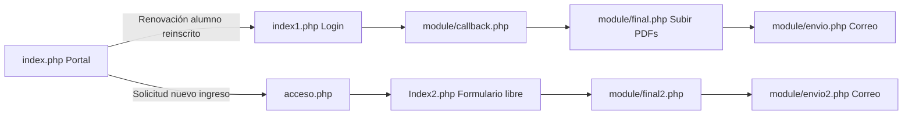

# El sistema legacy PHP (contexto obligatorio)

Repo de referencia: `c:\Users\rafas\Desktop\becas` (PHP + MySQL, servidor tradicional con FileZilla/hosting compartido). Esta app **no** modifica ese repo; solo replica y mejora una parte de su funcionalidad.

## Los dos flujos del portal

El portal viejo (`index.php`) tiene dos entradas completamente distintas:



| Flujo | Alcance de este proyecto | Archivos legacy |
|---|---|---|
| **Renovación** (alumno reinscrito, ya tiene beca) | Sí — es lo que esta app reemplaza | `index.php` → `index1.php` → `module/callback.php` → `module/final.php` → `module/envio.php` |
| **Solicitud nueva** (alumno de nuevo ingreso, sin historial) | No, todavía — proyecto futuro separado | `acceso.php` → `Index2.php` → `module/final2.php` → `module/envio2.php` |

No confundir los dos flujos: comparten "vocabulario" (beca, familiar, PDF) pero identifican al usuario de forma distinta y escriben en tablas distintas.

## Flujo de renovación paso a paso (legacy)

1. El padre/tutor entra a `index1.php` e ingresa **No. de Control** (`alumno_ref`) + **contraseña** (`alumno_clave`, guardada en `alumno_detalles`).
2. AJAX a `module/callback.php` con `opt=eeb684ae14469bdb120d54a25bd88811` (case de login):
   - Valida credenciales.
   - Verifica que exista una fila en `alumno_beca` con `beca_ciclo_escolar = <ciclo vigente>` y `beca_estatus = 1`. Si no la hay, código de error `201` ("no posee privilegios para renovar").
   - Si es válido, guarda en sesión PHP `us_id` (`alumno_id`), `us_name`, `us_acc` (`alumno_ref`), `tbecax` (`beca_id`).
   - Devuelve datos precargados: beca actual, datos de madre/padre (`alumno_familiar`), domicilio (`alumno_detalles`).
3. El formulario (`index1.php`) tiene 5 tabs: Datos de Beca (solo lectura), Alumno (domicilio), Padre, Madre, Adicional (motivo, otra beca, tipo de vivienda, hasta 4 hermanos).
4. Al enviar ("Guardar e ir a carga de Documentos"), AJAX a `callback.php` con otro `opt` que:
   - Genera un PDF de la solicitud con FPDF (`module/report/solicitud_beca_{us_id}.pdf`).
   - Hace INSERT/UPDATE en la tabla `becasr`, usando **el nombre completo concatenado** (`APP APM NOMBRE`) como llave, no `alumno_id`. Solo persiste `nombre`, `imensualp` (ingreso padre), `imensualm` (ingreso madre), `motivo`. **Los hermanos nunca se guardan en base de datos**, solo se usan para el cuerpo del correo/PDF.
   - Redirige a `module/final.php`.
5. `module/final.php` pide subir 4 PDFs obligatorios: comprobante(s) de ingresos, comprobante de domicilio, boleta SEP, comprobante de inscripción/reinscripción.
6. Al enviar el formulario de documentos, `module/envio.php`:
   - Envía correo vía PHPMailer a la coordinación según nivel (kinder/primaria/secundaria), con BCC a sistemas.
   - Adjunta los 4 PDFs subidos + el PDF de solicitud generado por FPDF.
   - Muestra pantalla de acuse; el cliente genera un PDF de comprobante con jsPDF.

### Snippet clave: identificación y regla de negocio

```22:56:c:\Users\rafas\Desktop\becas\module\callback.php
$nr=$db2->getNR("select a.alumno_id,alumno_nombre,alumno_ref from alumno_detalles d left join alumno a on d.alumno_id=a.alumno_id where alumno_ref='$data[1]' and alumno_clave='$data[2]';");
...
$has_beca=$db2->getNR("select * from alumno_beca where beca_ciclo_escolar=$ce and beca_estatus=1 and alumno_id=$dtr[0];");
```

Esta regla (**beca activa en el ciclo vigente = puede renovar**) es la única regla de negocio "dura" que la nueva app debe preservar siempre.

## Bug histórico que la nueva app evita repetir

El panel de coordinador del sistema PHP (`index_becas.html` + `module/procesos.php`) tenía dos fuentes de verdad para el checklist de documentos: la tabla vieja `becasr` y la tabla nueva `obs_becas`. Esto causaba que los checkboxes de documentos aparecieran vacíos al recargar porque se escribía en una tabla y se leía de otra. Se corrigió en el PHP unificando la lectura con `COALESCE`, pero en la app nueva se resuelve de raíz: **una sola tabla** (`becas_renovacion`) es la fuente de verdad del checklist de documentos. Ver `docs/03-esquema-base-datos.md`.

## Inventario completo de tablas del sistema legacy (~19 tablas)

Solo 7 son relevantes para este proyecto (renovación). El resto se documenta por completitud, para no confundir a un agente que explore el repo PHP.

| Grupo | Tablas | ¿Usado en este proyecto? |
|---|---|---|
| Núcleo de becas | `alumno`, `alumno_detalles`, `alumno_familiar`, `alumno_beca`, `concepto_beca`, `becasr`, `obs_becas` | Sí — mapeadas 1:1 a `becas_*` (ver doc 03) |
| Panel coordinador/admin | `usuario` | No — es login de coordinadores, no de padres |
| Pagos/colegiaturas | `pago_interno`, `concepto_interno`, `pago_estatus`, `pago_detalle`, `pago_rechazo` | No |
| Legacy (otra BD antigua, `getDBC`) | `iwc_gral_alu`, `iwc_gral_bca`, `iwc_gral_lvl`, `iwc_gral_pag_reg`, `iwc_gral_pag_det`, `alumnos15` | No |

## Archivos legacy que un agente debería leer si necesita más contexto

- `c:\Users\rafas\Desktop\becas\index1.php` — formulario completo (HTML + validaciones JS)
- `c:\Users\rafas\Desktop\becas\module\callback.php` — toda la lógica de login/precarga/guardado
- `c:\Users\rafas\Desktop\becas\module\final.php` — subida de documentos
- `c:\Users\rafas\Desktop\becas\module\envio.php` — envío de correo (no implementado todavía en la app nueva, ver doc 07)
- `c:\Users\rafas\Desktop\becas\module\procesos.php` — cómo el panel de coordinador lee el checklist (para entender el bug histórico)
