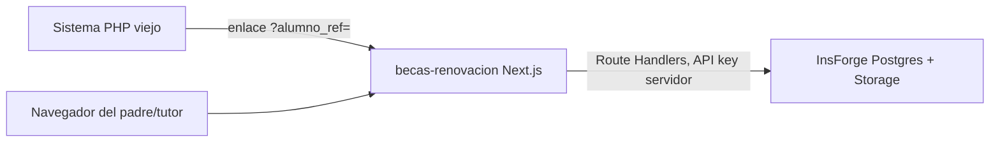

# Arquitectura de la app nueva

## Resumen



- El sistema PHP viejo es quien decide cuándo mostrar el enlace de renovación (típicamente cuando el padre inicia sesión ahí, o desde un correo/portal). Ese enlace incluye `?alumno_ref=<No.Control>`.
- Esta app **no reimplementa el login** del sistema viejo. Confía en que quien llega con un `alumno_ref` válido tiene derecho a ver esos datos, igual que cualquier enlace interno de un sistema ya autenticado.
- Toda la lectura/escritura de datos pasa por **Route Handlers de Next.js** (`src/app/api/**`) que usan la API key de servicio (`INSFORGE_API_KEY`) de InsForge. El navegador nunca habla directo con InsForge para estas tablas.

## Decisiones de diseño y por qué

### 1. Reusar tablas maestro `alumno*` (no duplicar con `becas_alumno*`)

InsForge ya tenía `alumno`, `alumno_detalles`, `alumno_familiar`, `alumno_beca` pobladas (mismo ecosistema Winston). La primera versión de esta app creó duplicados `becas_alumno*`; desde 2026-07-16 la API lee el maestro real y solo mantiene tablas propias de renovación (`becas_renovacion`, etc.). `becas_renovacion.alumno_id` es **integer** FK a `alumno.alumno_id`.

### 2. Tablas propias de renovación en `public` con prefijo `becas_`

InsForge/PostgREST expone `public`. Las tablas nuevas de renovación usan prefijo `becas_` para no chocar con el maestro.

### 2. Identificación por `alumno_ref` en la URL, sin contraseña

El sistema PHP viejo pedía No. de Control + contraseña. La nueva app es una **extensión**, no un sistema independiente: se asume que el sistema viejo ya validó al usuario antes de enviarlo aquí. Por eso el query param `alumno_ref` es suficiente — no se vuelve a pedir contraseña.

Esto tiene una implicación de seguridad importante: si alguien comparte o adivina una URL con un `alumno_ref` ajeno, podría ver esos datos. Se mitigó así:

- Las tablas `becas_*` **no** tienen permisos para `anon`/`authenticated` (RLS/grants revocados). Nadie puede leerlas vía SDK público, con o sin el `alumno_ref` correcto.
- Los Route Handlers son el único punto de acceso, y solo devuelven datos si además se cumple la regla de negocio (beca activa en el ciclo vigente).
- **Pendiente para producción** (ver doc 07): agregar una firma/token de corta duración al enlace generado por el sistema PHP, en vez de un `alumno_ref` en texto plano, si se requiere mayor seguridad. No se implementó porque no fue parte del alcance solicitado, pero queda documentado como mejora futura.

### 3. Esquema normalizado, no una copia 1:1 del legacy

El legacy tiene el bug histórico de dos tablas (`becasr` + `obs_becas`) para el mismo checklist de documentos. La app nueva usa **una sola tabla** (`becas_renovacion`) por alumno/ciclo escolar como fuente única de verdad. También persiste datos que el legacy capturaba pero nunca guardaba (hermanos) y reemplaza el guardado de PDFs en disco por InsForge Storage con referencia en base de datos (`becas_documento`).

### 4. Cliente InsForge admin solo en el servidor

`src/lib/insforge-server.ts` crea el cliente con `createAdminClient({ baseUrl, apiKey })`. Este archivo y todo lo que lo importa **debe** ejecutarse solo en servidor (Route Handlers, Server Components sin `'use client'`). Nunca importar `insforge-server.ts` desde un archivo con `'use client'`.

## Ciclo escolar vigente

`src/lib/ciclo-escolar.ts` replica exactamente la fórmula del PHP (`core.php` / `becas_db.php`):

```ts
// Si hoy es >= 10 de julio, el ciclo que inicia es "startYear"; si no, es el año anterior.
const startYear = (month > 7 || (month === 7 && day >= 10)) ? year : year - 1;
const ciclo = startYear - 2003;
```

Esto importa porque `becas_alumno_beca.beca_ciclo_escolar` y `becas_renovacion.ciclo_escolar` se filtran/guardan siempre contra este valor calculado en el servidor, nunca lo manda el cliente.

## Modelo de seguridad (resumen operativo)

| Capa | Quién puede acceder | Cómo |
|---|---|---|
| Tablas `becas_*` en InsForge | Solo `project_admin` / API key de servicio | `REVOKE ALL ... FROM anon, authenticated` en la migración |
| Bucket `becas-documentos` | Privado, solo vía API key de servicio | `storage create-bucket --private` |
| Route Handlers Next.js | Cualquiera con la URL + `alumno_ref` válido y beca activa | Validación de negocio en `GET /api/renovacion` |
| Variables de entorno | `INSFORGE_API_KEY` nunca en el bundle del cliente | Solo variables sin prefijo `NEXT_PUBLIC_*` para credenciales sensibles |

## Dónde vive cada cosa

```text
becas-renovacion/
├── AGENTS.md                          # punto de entrada para agentes de IA
├── docs/                              # esta carpeta
├── migrations/                        # DDL de InsForge (SQL versionado)
├── scripts/
│   ├── migrate-mysql-to-insforge.ts   # ETL legacy -> InsForge
│   └── data/                          # JSON exportado de MySQL (no versionar datos reales)
└── src/
    ├── app/
    │   ├── page.tsx                   # home con enlace de ejemplo
    │   ├── renovacion/
    │   │   ├── page.tsx               # orquesta el flujo (form -> docs -> confirmación)
    │   │   └── components/            # TabsFormulario, SubirDocumentos, ResumenConfirmacion
    │   └── api/renovacion/
    │       ├── route.ts               # GET precarga, POST guarda renovación
    │       └── documentos/route.ts    # POST sube PDF a Storage
    └── lib/
        ├── insforge-server.ts         # cliente admin, SOLO servidor
        ├── ciclo-escolar.ts           # cálculo de ciclo escolar vigente
        └── types.ts                   # tipos TS compartidos del dominio
```
