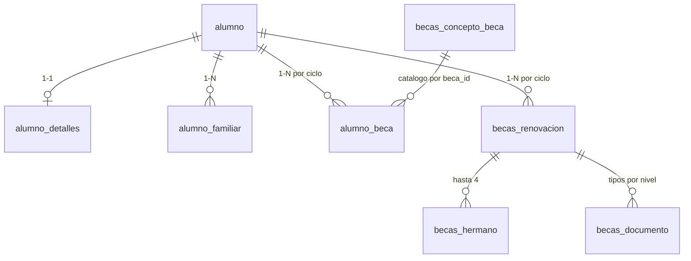

# Esquema de base de datos (InsForge)

Proyecto InsForge: `Winston Servicios` (`1a769c0a-ab1b-4500-bb6b-1e8bb131980b`).

## Modelo vigente (2026-07-16)



### Maestro (tablas existentes — no migrar / no duplicar)

| Tabla | PK | Notas clave |
|---|---|---|
| `alumno` | `alumno_id` integer | `alumno_ref` también **integer** (No. Control). `alumno_grupo` en BD es entero (`0`=sin grupo, `1`=A, `2`=B, `3`=C); UI/PDF/correo usan `labelGrupo` en `src/lib/label-grupo.ts`. |
| `alumno_detalles` | `detalle_id` integer | `alumno_cp` es integer; domicilio editable desde renovación |
| `alumno_familiar` | `familiar_id` integer | `tutor_id` 1=madre, 2=padre; `familiar_vive` smallint 0/1 |
| `alumno_beca` | `alumno_beca_id` integer | Renovación: `beca_estatus=0` + ciclo a renovar (beca cerrada pendiente de renovar); incluye `alumno_ref` |

### Propias de renovación

| Tabla | Notas |
|---|---|
| `becas_concepto_beca` | Catálogo seed 17 tipos |
| `becas_renovacion` | `alumno_id` **integer** FK → `alumno.alumno_id`. Columnas `ingreso_mensual_padre/madre` **existen pero siempre se guardan NULL** (política de privacidad; los sueldos solo van en el PDF de solicitud). |
| `becas_hermano` | Persistencia de hermanos (el PHP no lo guardaba) |
| `becas_documento` | Refs a bucket `becas-documentos`. Tipos: `acta_nacimiento`, `curp`, `curp_tutor`, `constancia_no_adeudo`, `carta_buena_conducta`, `boleta_interna`. |

### Deprecadas — no usar en código nuevo

`becas_alumno`, `becas_alumno_detalle`, `becas_familiar`, `becas_alumno_beca` (duplicados de la primera migración; vacíos / desligados del flujo).

## Migraciones aplicadas

1. `20260716161403_create-becas-schema.sql` — tablas `becas_*` iniciales.
2. `20260716164134_relink-renovacion-to-alumno.sql` — `becas_renovacion.alumno_id` pasa a integer FK a `alumno`.
3. `20260716205052_null-ingresos-renovacion.sql` — limpia `ingreso_mensual_padre/madre` a NULL (política de privacidad).
4. `20260717203413_create-becas-solicitud.sql` — solicitud nueva + permiso.
5. `20260717223000_documentos-por-nivel.sql` — catálogo docs por nivel/trámite (reemplaza ingresos|domicilio|boleta|comp_inscripcion).

## Inspección

```bash
npx @insforge/cli db query "SELECT data_type FROM information_schema.columns WHERE table_name='becas_renovacion' AND column_name='alumno_id';"
npx @insforge/cli db query "SELECT count(*) FROM public.alumno_beca WHERE beca_estatus=1;"
```
