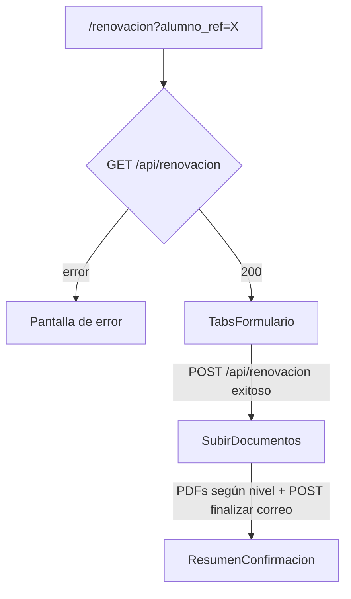

# Frontend: páginas y componentes

## Flujo de pantallas

Toda la orquestación vive en `src/app/renovacion/page.tsx` (`RenovacionContent`), que mantiene el estado de `step: 'form' | 'docs' | 'done'` y el `renovacionId` una vez creado.

## Shell compartido (`AppShell` / `AppHeader` / `AppFooter`)

- `AppHeader` recibe `titulo` por trámite: home → `Portal de Becas`; renovación → `Renovación de Beca`; solicitud → `Solicitud de Beca`. **No hardcodear** renovación.
- `AppFooter` usa el nombre neutro `Portal de Becas v…`.
- `StepIndicator` acepta `ariaLabel` (p. ej. “Progreso de solicitud de beca”).

## `src/app/renovacion/page.tsx`

- Lee `alumno_ref` de `useSearchParams()`. Si falta, muestra mensaje de error sin llamar a la API.
- En `useEffect`, hace `fetch('/api/renovacion?alumno_ref=...')` y guarda el resultado en `data` (tipo `RenovacionPrecarga`).
- Envuelto en `<Suspense>` porque `useSearchParams()` lo requiere en App Router.
- Renderiza condicionalmente: loading → error → `TabsFormulario` → `SubirDocumentos` → `ResumenConfirmacion`, según `step`.

## `src/app/renovacion/components/TabsFormulario.tsx`

Réplica funcional de los 5 tabs de `index1.php` legacy, con estado local por campo (no usa una librería de formularios; el dominio es pequeño y no lo justifica).

| Tab | Contenido | Editable |
|---|---|---|
| 0. Datos de Beca | Alumno, No. Control, tipo de beca, %, ciclo, promedio requerido | No — solo lectura, viene de `becas_alumno_beca` + `becas_concepto_beca` |
| 1. Alumno | Calle, número, colonia, CP (municipio/estado fijos: MADERO/TAMAULIPAS) | Sí |
| 2. Padre | Nombre, ¿vive?, ingreso mensual, empresa, puesto, tel, cel, email | Sí (ingreso no se guarda en BD; leyenda de privacidad bajo el campo) |
| 3. Madre | Igual que Padre | Sí (igual que Padre) |
| 4. Adicional | Otra beca, tipo de vivienda, motivo (textarea, máx 500), observaciones, botón para mostrar hasta 4 hermanos (nombre, edad, institución, colegiatura) | Sí |

Notas de implementación:

- El nombre de madre/padre se maneja como un solo campo de texto en la UI (`mamaNombre`, `papaNombre`) y se separa en `familiar_app`/`familiar_apm`/`familiar_nombre` con `splitNombre()` al guardar (heurística simple por espacios: 1 palabra → nombre, 2 → app+nombre, 3+ → app+apm+resto).
- `showHermanos` controla si la sección de hermanos se muestra y si se envían al guardar; si está oculta, se envía `hermanos: []`.
- Validación de "ingreso mensual obligatorio si vive" **no se valida en el cliente**, se valida en el servidor (`POST /api/renovacion`) y el error se muestra en el bloque `error` de este componente. Si se quiere feedback más inmediato, se puede añadir validación de cliente aquí, pero la validación de servidor debe permanecer como fuente de verdad.
- Los ingresos **no se precargan** desde `data.renovacion` (siempre `null` en GET); el usuario los captura de nuevo cada vez. Solo se usan para el PDF de solicitud al guardar.
- Al guardar exitosamente, llama a `onSaved(renovacionId)` que la página usa para avanzar a `step = 'docs'`.

## `src/app/renovacion/components/SubirDocumentos.tsx`

- Recibe `renovacionId`, `documentosIniciales`, `nivel` y `grado` (para armar la lista con `docsRequeridos`).
- Un input de archivo por tipo requerido; sube inmediatamente al seleccionar el archivo.
- Estado visual por documento: badge "Pendiente" (ámbar) o "Subido" (verde).
- El botón "Finalizar renovación" solo se habilita cuando todos los docs de la lista dinámica están subidos (4 o 6 según grupo escolar).
- Al finalizar llama `POST /api/renovacion/finalizar` (envío de correo); si falla muestra error y no avanza.
- Si `GET` devuelve `ya_registrado: true`, la página salta a confirmación/comprobante y no muestra el formulario.
- Al completar, llama a `onComplete()` que avanza a `step = 'done'`.

## `src/app/renovacion/components/ResumenConfirmacion.tsx`

Pantalla final — muestra nombre, No. Control, grado/grupo y ciclo. El grupo se muestra con `labelGrupo` (0→sin grupo, 1→A, 2→B, 3→C). El correo ya se envió en el paso anterior. Incluye botón **Descargar comprobante** (`GET /api/renovacion/comprobante`).

## Convenciones de estilo

- Tailwind puro, sin librería de componentes UI. Paleta: azul (`blue-700`/`blue-800`) para acciones primarias y encabezado, ámbar para "pendiente", esmeralda para "completado"/confirmación, rojo para errores.
- Los inputs comparten las constantes `inputClass`/`labelClass` definidas al inicio de cada componente — si se agregan más campos, reutilizar esas clases en vez de repetir strings de Tailwind.
- Todos los componentes de `renovacion/components/` son `'use client'` porque manejan estado e interactividad; los Route Handlers y `lib/insforge-server.ts` son los únicos que deben permanecer estrictamente server-only.

## Si vas a agregar una pantalla nueva

1. Decide si necesita datos precargados nuevos → probablemente amplíes `RenovacionPrecarga` en `src/lib/types.ts` y el `GET /api/renovacion`.
2. Sigue el patrón de props explícitas (no Context/Redux) — el flujo es lineal y corto, no lo compliques con estado global salvo que el alcance crezca mucho.
3. Actualiza el diagrama de flujo de pantallas en este documento.
